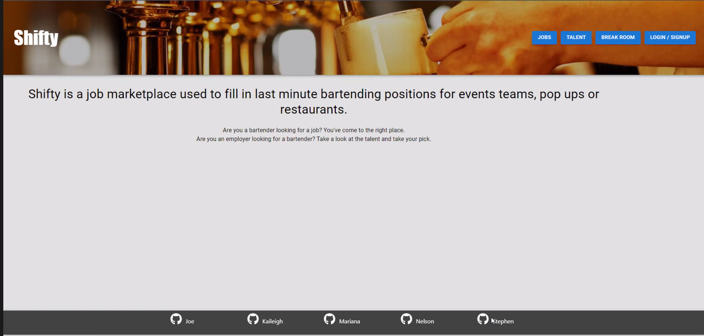
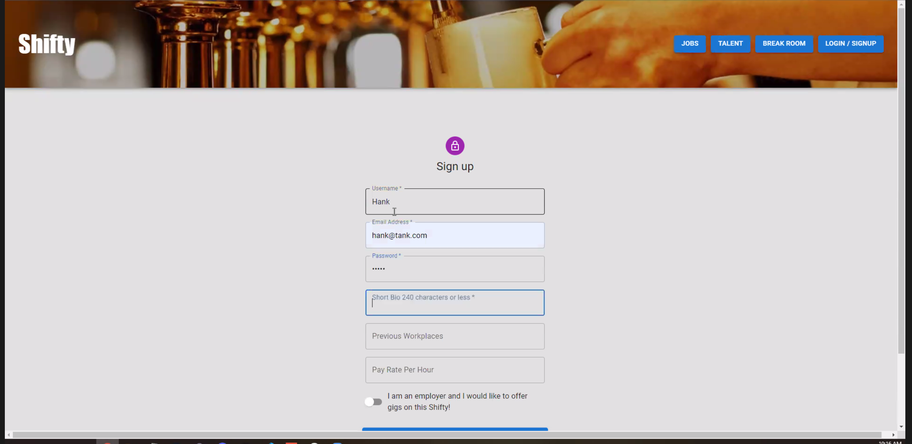
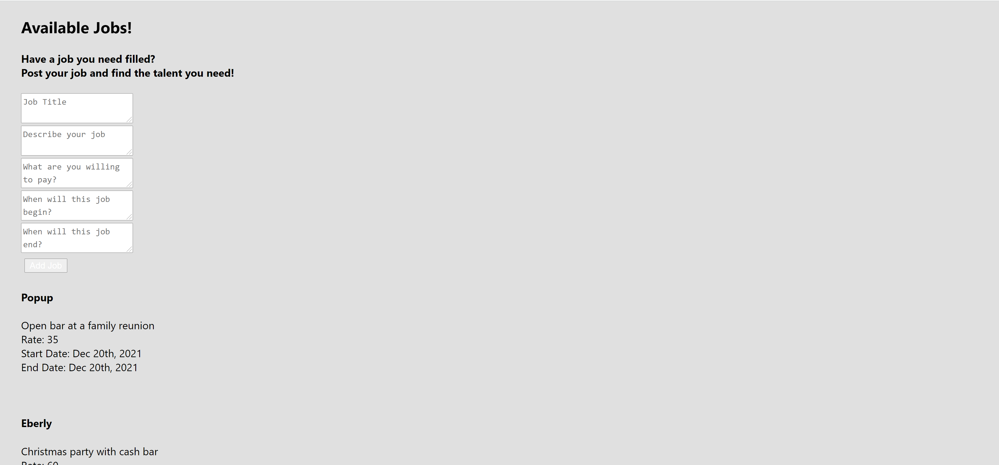
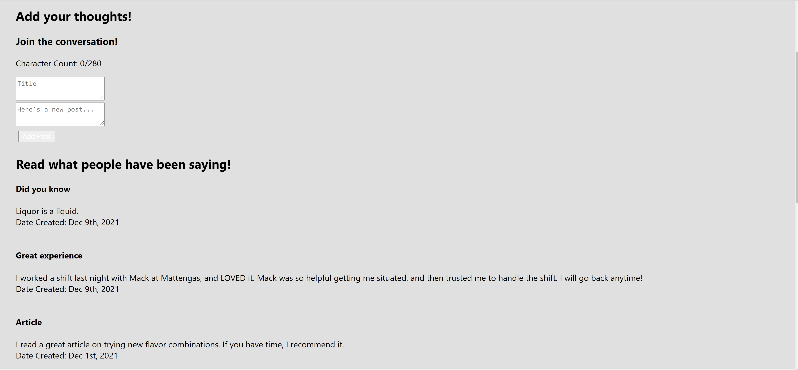
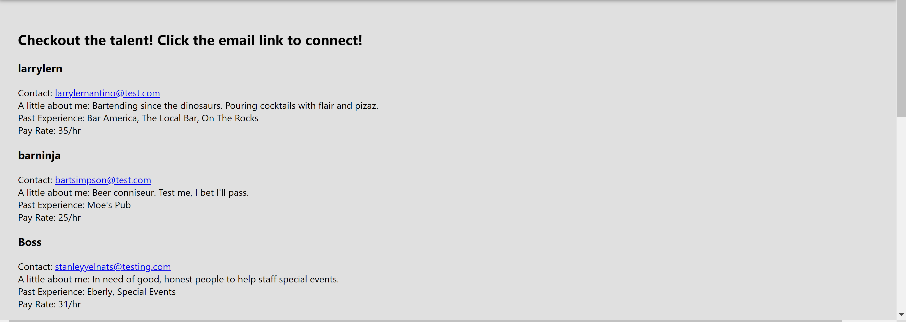

# Shifty
Project 3

deployed link: https://protected-bastion-67300.herokuapp.com/

github repo: https://github.com/riveranelson99/shifty

screenshots:

## Description
Application allows bartenders to apply for jobs, along with allowing employers to post available positions.  The user will see a landing page describing what the application is.  Then they will click on any of the navigation buttons, and be redirected to that page.  The user will be able to view all jobs created, as well as any posts created.  The user is also able to create their own posts, and their own jobs.

## Technology used
- MongoDB
- Express.js
- React.js
- Node.js
- Material UI
- GraphQL
- jsonwebtoken
- bcrypt
- mongoose
- fortawesome

## Authors and Acknowledgements
In alphabetical order:

Joe Kowalczyk- https://github.com/jdkowal
Kaileigh Bonaccorsi- https://github.com/kbonaccorsi
Nelson Rivera- https://github.com/riveranelson99
Mariana Solayman- https://github.com/mas0530
Stephen Thompson- https://github.com/SThompsonChicago
